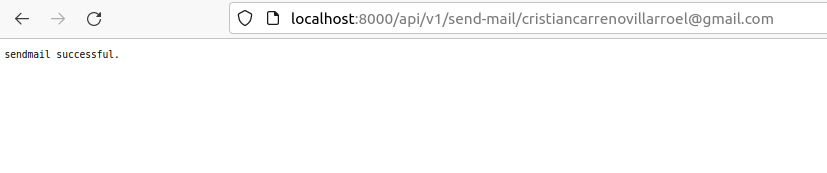
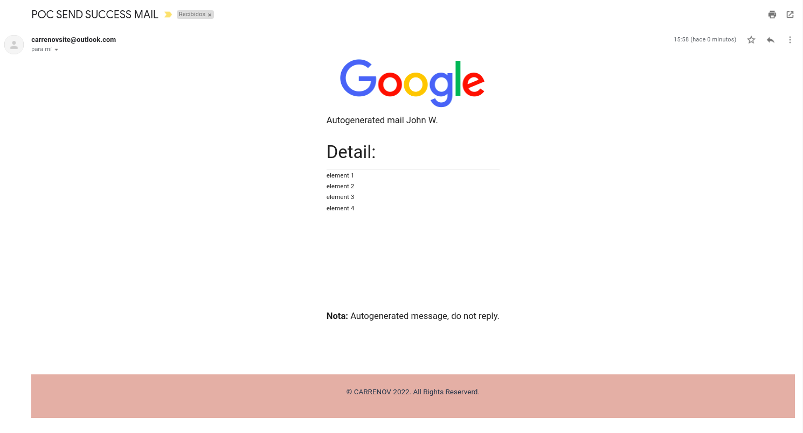

# ms-sendmail
## Project mail senders

### DEPENDENCY

Install library with command:

```
pip install -r requirements.txt
```
or 

```
python -m pip install -r requirements.txt
```

### PROPERTIES

Config outlook mail properties in ConfigFile.properties (folder source/properties). Replace the parameters for your outlook account:

```
mail.smtp.user=carrenov@outlook.com
mail.smtp.password=123456789
```

### DEPLOY

For deploy execute this command line:

```
python manage.py runserver
```

### EXECUTE SEND MAIL

In the web browser add following url:

```
http://localhost:8000/api/v1/send-mail/yourmail@example.com
```
Modify **yourmail@example.com** by destination mail.


Example notification send mail.




